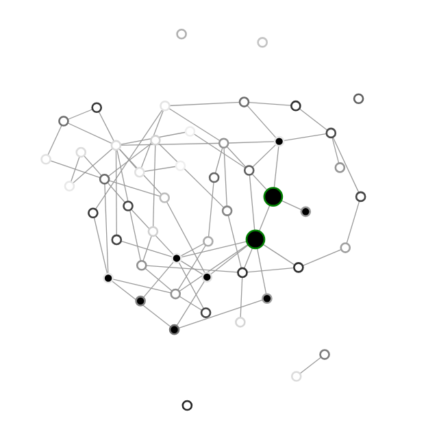

# LTM Simulation



[Run the Simulation](http://galenwilkerson.github.io/ltm_logic_3.html)

This repository contains an interactive simulation of the Linear Threshold Model (LTM), which demonstrates the logic functions computed by the model. 

The LTM represents one of the simplest models of the emergence of information processing in systems and is considered universal due to its connection to percolation theory (see Watts). This model helps in understanding how local interactions can lead to complex global behaviors and spontaneous computation in networks. The simulation allows users to adjust various parameters and observe the behavior of the network.

## Features

- Adjust the number of nodes, input nodes, mean degree, frame duration, and threshold values using sliders.
- Visualize the network and observe the state changes of nodes during the simulation.
- Highlight the corresponding row in the truth table for each step of the simulation.
- Start, stop, and regenerate the simulation with buttons.

## Usage

The repository for this project is available at:

[GitHub Repository](https://github.com/galenwilkerson/LTM-logic-interactive)

## References

This simulation is based on the concepts presented in the following papers:

- Wilkerson, G. et al. "Spontaneous Emergence of Computation in Network Cascades." *Nature Scientific Reports*.
- Watts, D. J. "A Simple Model of Global Cascades on Random Networks." *Proceedings of the National Academy of Sciences*.

## Installation

To run the simulation locally, clone the repository and open the `ltm_logic_3.html` file in your web browser.

```bash
git clone https://github.com/galenwilkerson/LTM-logic-interactive
cd LTM-logic-interactive
open ltm_logic_3.html
